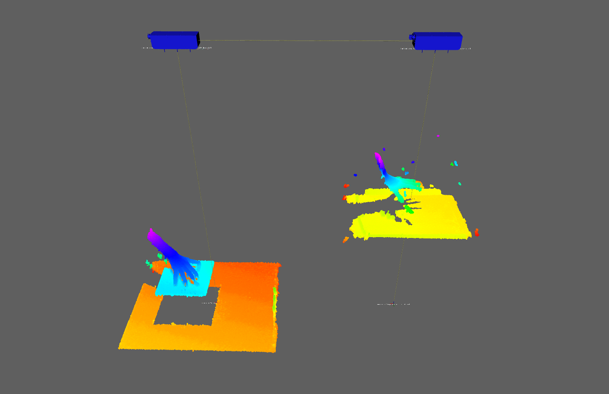

### Overview
This repository holds code of a [ROS](http://www.ros.org) package for point cloud acquisition with  [EnsensoNx](https://en.ids-imaging.com/ensenso-stereo-3d-camera.html) 3D cameras. It is basically a ROS wrapper of the low-level API provided by [IDS](https://en.ids-imaging.com), the manufacturer of the camera. The ROS node can be configured to act as a server or as publisher at a given rate.
The package has been tested with N20 and N35 cameras.



### Dependencies
This package works correctly with the following dependencies:
* Ubuntu 16.04
* CMake + gcc
* [ROS Kinetic](http://wiki.ros.org/kinetic)
* [Point Cloud Library v1.7](http://www.pointclouds.org/) (shipped with ROS Kinetic)
* UEYE driver 4.81.1 and 4.90.5 (camera interface from manufacturer IDS)
* Ensenso SDK 1.3.18, 2.0.140 and 2.2.65(propietary library from manufacturer IDS, check correspondence with UEYE driver though at [Ensenso Site](https://www.ensenso.com/support/sdk-download/))
* [Forked version](https://github.com/beta-robots/common_msgs) of ROS sensor_msgs, with definition of `SnapshotCloud.srv`

To install the latest three dependencies of the above list:

1. Download the UEYE from the [IDS website](http://www.ensenso.com/support/sdk-download/) (file uEye_4.90.5_Linux_64.tgz)

2. Uncompress, move to the folder and run the script (ethernet or usb as needed)
```shell
$ sudo sh ./ueyesdk-setup-4.81.01-eth-amd64.gz.run
```

3. Download the SDK from the [IDS website](http://www.ensenso.com/support/sdk-download/) (file ensenso-sdk-2.2.65-x64.deb)

4. Install it with
```shell
$ sudo dpkg -i ensenso-sdk-2.2.65-x64.deb
```

5. Clone to your ROS workspace /src the forked version of common_msgs
```shell
$ git clone https://github.com/beta-robots/common_msgs.git
```

6. Build them with
```shell
$ catkin_make --only-pkg-with-deps common_msgs
```


### Download and Build this ROS package
1. Make sure that your ~/.bashrc contains these lines (the order is important):
```shell
source /opt/ros/kinetic/setup.bash
source /home/user_name/catkin_ws/devel/setup.bash
```

2. At the end of your ~/.bashrc file, add the following line:
```shell
export ENSENSO_INSTALL=/opt/ensenso
```

3. Do not forget to source again your .bashrc, or open a new terminal.

4. Download this repository to your ROS workspace /src, with the command:
```shell
$ git clone https://github.com/beta-robots/ensenso_nx.git
```

5. and from your ROS workspace, build it with:
```shell
$ catkin_make --only-pkg-with-deps ensenso_nx
```

### Camera Operation
1. Start the ueye daemon (in case it didn't started on system boot):
```shell
$ sudo /etc/init.d/ueyeethdrc start
```

2. Decide whether you want to operate the camera as a publisher or as a server, by setting the run_mode parameter of the config/ensenso_nx_params.yaml file. Thereafter, run the node (by default a rviz window will appear)
```shell
$ roslaunch ensenso_nx ensenso_nx.launch
```

3. If you are running the node in mode "SERVER", from another terminal request a Point Cloud capture, providing the dense point cloud flag and a given exposure value (0 meaning autoexposure):
```shell
$ rosservice call /ensenso_nx/ensenso_server "dense_cloud: false exposure: 0"
```

4. Open an rqt window for dynamic reconfigure and change parameters and mode in runtime.

### Troubleshooting
- The IDS application nxView shows 3D realtime data, and allows to manage all parameters involved in the stereo computation.
```shell
$ nxView
```

- Check that the IP of the computer and that of the camera are in the same network. To manually set the IP of the camera, or manage other configurations, go to:
```shell
$ ueyecameramanager
```


- In some cases you have to manually edit the file **/usr/local/share/ueye/ueyeethd/ueyeethd.conf** with sudo privileges and set the interface and port. For instance, if you are using eth0 interface, the file should look like:
```shell
;ueye configuration file

[Parameters]
Interfaces = eth0

[eth0]
Port_Base = 50000
```

- Sometimes you have to stop the ueye daemon an then start it again
```shell
$ sudo /etc/init.d/ueyeethdrc stop
$ sudo /etc/init.d/ueyeethdrc start
```

- The firmare of your camera might not correspond with the drivers you download above. In order to be sure you have it, use the camera manager, i.e.
```shell
$ ueyecameramanager
```
And click the button __Upload starter firmware__.

- Not closing properly the camera might lead to issues in operation, throwing the following exception:
```
An NxLib error when executing the command:
Open:
UEyeApiException: UEye API error -1(General error message) at </common/uEye/uEyeCamera.cpp:686>.
```
The line in the `uEyeCamera.cpp` file might vary depending on the version of the ueye driver you have installed. This issue can be aggravated in high temperatures conditions. The main reason for not closing properly is because the software didn't have enough time to close properly, due to a long ethernet cable or poor cable quality or a heavy loaded network.

If you are using `roslaunch`, you might need to increase the timeout used to escalate to `SIGTERM`. You can find those values [here](https://github.com/ros/ros_comm/blob/melodic-devel/tools/roslaunch/src/roslaunch/nodeprocess.py#L58-L59) for instance. This modification is PC-based as this values are not configurable.
